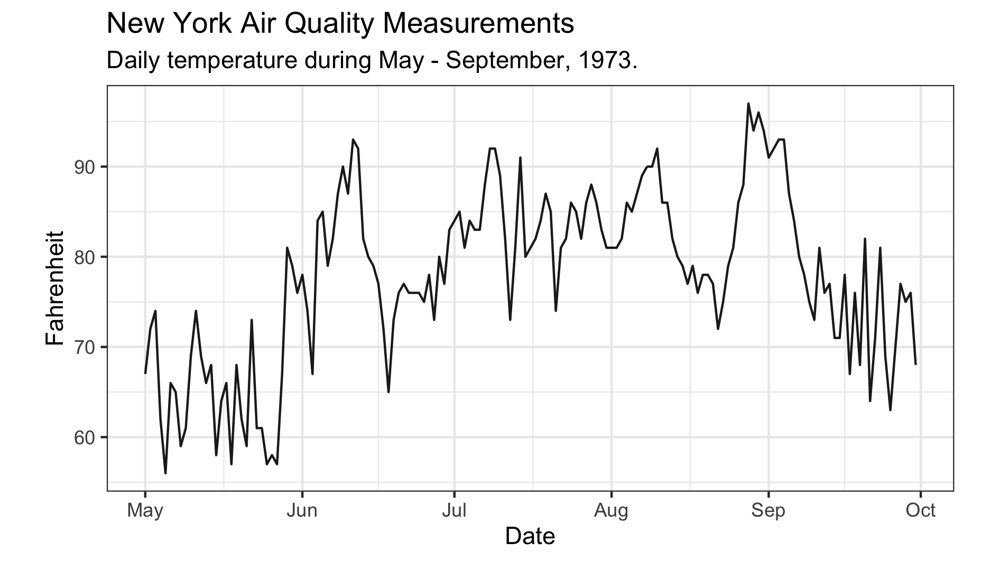
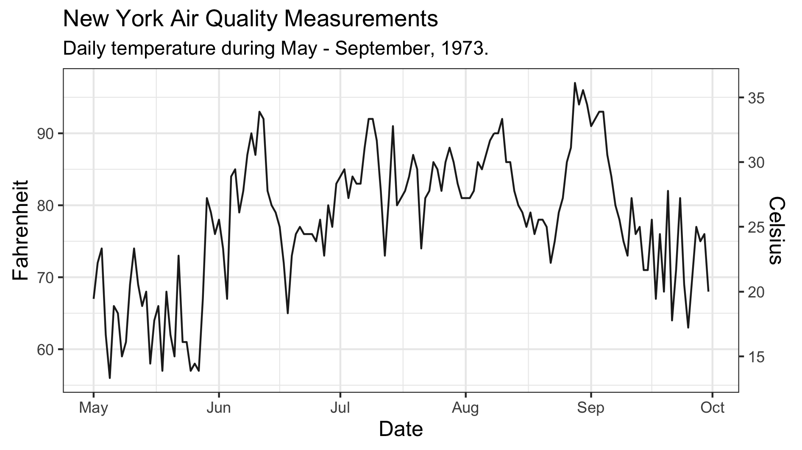

### Introduction

Dual-axis plots are often used to jointly display time-series data that differ in magnitude — and in some cases, each axis may exist on completely different scales altogether. For this reason, dual-axis plots are generally discouraged because they require readers to interpret two, sometimes very disparate, axes.

For the reader, this can create confusion — as well as invite misinterpretation — particularly when the lines appear to be changing in a similar way. If close attention isn’t paid to the values on *both* axes readers may interpret the rate of change as being similar for both series (or perhaps *not* changing). Alternatively, if points from either series happen to coincide in space, readers may falsely equate these points, despite each datum having very different values.

Now, these are not the only problems that can arise (and for a very nice blog on the issues with dual-axis plots you should check out [this](https://blog.datawrapper.de/dualaxis/)), but I’m not here to discuss what’s *wrong* with dual-axis plots. Instead, what I want to do is share an example where having two axes is actually *useful*. I found the code for this while tidying up some of my Data Camp coursework and thought it was pretty cool. Hopefully, you’ll find it useful, too.

Let’s get into it.

### Warming Up

This example looks at the case for two axes when data can be expressed using two monotonic scales, like temperature. To illustrate, we’ll use the `airquality` dataset in R to plot daily temperature readings recorded between May-September, 1973, in New York. Before getting things underway, make sure you have the `tidyverse` and `lubridate` packages loaded. Once that's done, we’ll first need to create a date column. The code below shows how you can do this using the `mutate` function:

``` r
# Formatting to create Date column
airquality_dt <- airquality %>% 
                 mutate( Date = dmy( str_c( Day, Month, "1973", sep = "/")) )
```

Now that you have a proper date variable, you can use this to plot a time series of the daily recorded temperatures. We’ll use the code below to create a base plot which we’ll add to shortly:

``` r
# Create a base plot that will later be added to
base_plot <- ggplot( airquality_dt, 
                     aes( x = Date, y = Temp )) +
             geom_line( alpha = .9 ) +
             coord_fixed( ratio =  1.78 ) +
             labs( x = "Date", 
                   y = "Fahrenheit", 
                   title = "New York Air Quality Measurements", 
                   subtitle = "Daily temperature during May - September, 1973.") +
             theme_bw()
```

Okay, so there shouldn't be anything mysterious going on here. I’m just using the `geom_line` function to generate a bulk standard time series plot (though I did tweak the transparency slightly). All in all, I’m taking a rather minimalist approach and have gone with a simple black-and-white theme.

Note, however, the use of the `coord_fixed` function, where I have specified a 16:9 aspect ratio (or 1.78:1). Personally, I think this ratio works really well, but feel free to select an alternative that works for you. After adding a few labels and titles we have a pretty decent-looking graphic.

{fig-align="center"}

Here’s the issue, though.

You see, for those of us living in the Antipodes, we’re accustomed to using the Celsius scale to quantify temperature, meaning the current *y*-axis leaves us utterly perplexed and bamboozled. The only thing more confusing than this scale is the transformation to Celsius — where did that 5/9 come from? Anyway, it’d be great if we could include the Celsius scale, along with the original Fahrenheit temperatures, so we Kiwis can appreciate how hot things are getting.

### Scales & Degrees

The first thing we need to do is to specify some break points along the *original* *y*-axis. We’ll then transform these points onto the Celsius scale and then use those to *label* the second axis. The code below does just that — the `y_breaks`vector contains six points along the Fahrenheit scale which have then been transformed onto the Celsius scale and stored in a variable called `y_labels`. From there the second axis can be initialized, as shown below:

``` r
# Specify break points in Fahrenheit and transform labels to Celsius 
y_breaks <- c(59, 68, 77, 86, 95, 104)
y_labels <- (y_breaks - 32) * 5 / 9

# Initialize the second axis
secondary_y_axis <- sec_axis(
  trans  = identity,
  name   = "Celsius",
  breaks = y_breaks,
  labels = y_labels
)
```

Now, this isn’t the only way to initialize the secondary axis, but I find it neater by pulling the `sec_axis` definition out from the plot call. The important thing to note here is the transformation argument is set to `trans = identity`. Remember, the breakpoints are defined on the *original* scale and the transformation is only applied to derive the new labels. All that’s left to do is give the axis a reasonable name — like, “Celsius”.

With the secondary axis built, we’ll simply add it to the base plot and print!

``` r
# Add second to base plot to produce final plot
final_plot <- base_plot + 
              scale_y_continuous( sec.axis = secondary_y_axis ) +
              theme( axis.title.x = element_text( size = 12 ), 
                     axis.title.y = element_text( size = 12 ))
```



That’s looking pretty good to me! And now I finally understand just how hot 90 degrees Fahrenheit is. Good thing we added that second axis.
