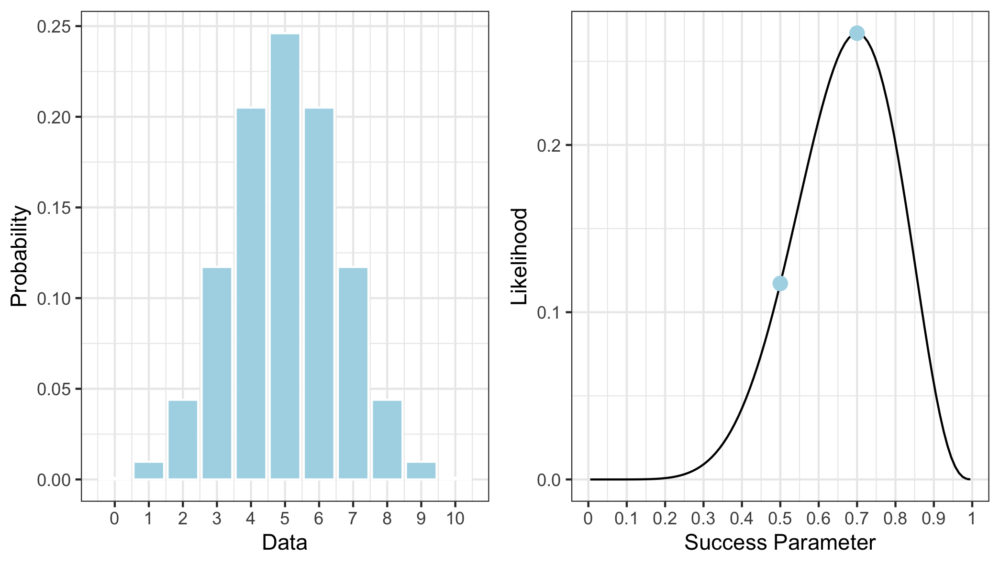

### Introduction

From the perspective of machine learning and data science, probabilities and likelihoods are used to quantify uncertainty, or perhaps how probable it is that an observation belongs to one class or another. They crop up when looking at confusion matrices; and indeed, algorithms like Naive Bayes classification are pretty much probabilistic models. The reality is that data scientists cannot escape these concepts.

In everyday language, though, we tend to use the terms probability and likelihood almost interchangeably. Indeed, it’s not uncommon to hear things like ‘how likely is it to rain today?’ or ‘what are the chances of this or that happening?’ And I’ll be honest; it wasn’t a distinction that was initially apparent to me, but probability and likelihood are *different* (albeit related) concepts. This interchangeability can often creep into our work as data scientists, so it’s important to be clear about the distinction between the two terms. So, in this post, I thought I’d have a crack at illustrating the difference between these two ideas.

### Probability

In a nutshell, the fundamental difference between probability and likelihood lies in what is allowed to *vary —* let me explain.

What you need to know is that *likelihood* — though to be specific, I’m actually talking about the *likelihood function* — is actually derived from a statistical model and is considered a function over the parameters that generate data from that model. Confused? Don’t worry — let's be a little more concrete and consider tossing a fair coin ten times.

We know that this is a Binomial process that is governed by a rate parameter $p$ that defines the expected probability of throwing $K$ heads (or tails — it doesn’t matter which) out of a total of $N$ throws. Here, the number of observed heads, $K$, is a random variable that changes in response to different values of $p$. For any fixed parameter value (e.g., $p = 0.7$), the *probability* of observing $K$ heads is given by the probability mass function (PMF):

$$
P(K = k) = \binom{N}{k} \ p^k \ \left( 1 - p\right)^{N - k}
$$

where

$$
\binom{N}{k} = \frac{N!}{k! \ (N - k)!}
$$

Now, because I said the coin is fair, and it was tossed ten times, we can let $p = 0.5$ and $N = 10$. If we then plug these values into the equation above — and let $K$ vary — we get something that looks like the left panel of Figure 1. Based upon this, we can see that $K = 5$ is the most probable outcome, which should make sense: if the coin is fair, and we toss it ten times, we should expect that — in the long run — we’ll get 5 heads and 5 tails more often than not. But you should also note that getting 4 or 6 heads isn’t all that uncommon, either.

So, what the PMF tells us is how probable particular realisations of the random process are *given* a fixed set of model parameters. In this instance, we assume the model parameters are *fixed* and it is the data that is free to *vary*. The takeaway here is that, if the model parameters are known, then we are asking questions about the kinds of data that might be observed.

### Likelihood

Okay, so what if instead, I tell you that I already flipped the coin ten times and got $K = 7$ heads? My question to you is whether the coin I threw was fair or not.

What’s important to note is that, in this case, $K$ is no longer random — we have an *observed* realization of the Binomial process meaning it is now a fixed value. Given this information, the likelihood function for the Binomial model can be written as:

$$
\mathcal{L}( \theta \ | \ K = \hat{k}) = P(K = \hat{k})
$$

Here, I’m using “hat” notation to make it clear that $K$ is the observed number of heads from ten throws. Now, this just looks like I’m saying that the likelihood function is the same thing as the PMF — well, I kind of *am* saying that. But, the difference here is that now the *data is fixed* and it is the model parameter, $p$, that is free to vary.

What the likelihood function gives us is a *measure* of how likely any particular value of $p$ is given that we know that $K$ equals some observed value. Just like above, if we plug $K = 7$ into the equation above — letting $p$ take on all possible values — we’d get something like the right panel in the above figure. Note that here the likelihood function is not symmetrical; rather, it is peaked over $p = .7$. Specifically, the *mode* of this distribution (i.e., the peak itself) coincides with something called the *maximum likelihood estimate* (MLE). What’s that? Well, it’s the value of $p$ that is most likely given the observed data — the name sort of gives it away, really. I’ll talk more about MLE in another post, but for now, all that you need to know is that value of the likelihood function at the MLE is approximately .27.

Okay, before moving on, a note of caution: I know the likelihood function looks like a distribution function, but it is **not** a proper probability density function (i.e., it typically doesn’t integrate to 1). More importantly, the likelihood function is **not** the probability that *p* equals a particular value (for that you’ll need to compute the posterior distribution. I’ll talk about that in another post).

Right, moving on.

### Statistical Evidence

Remember when I said that the likelihood function is interpreted as a measure? Well, specifically, it can be used to quantify statistical evidence. I also said that all you needed to know about the MLE is that it has a likelihood value of approximately .27. But what does this tell us? What does it mean to say that the likelihood is approximately .27? It certainly doesn’t tell us whether or not the coin I used was fair or not — so where to from here?

I need to introduce a couple of things:

-   **The Likelihood Principle** states that, for a given statistical model, all the evidence relevant to model parameters exists within the sampled (observed) data itself.

-   **The Law of Likelihood** states that the extent to which the evidence supports one parameter value over another is determined by the ratio of their respective likelihoods.

Taking these ideas together implies that looking at a single likelihood in isolation tells us very little. Yes, it provides a measure of evidence, but relative to what? The definitions above tell us that likelihoods are more useful when they’re compared to *other* likelihoods. That’s why we typically prefer relative measures such as *likelihood ratios*.

With this in mind, recall my question to you was whether, based on the data you have, the coin I tossed was fair. To properly address this question we also require the likelihood of observing the data if $p = 0.5$, which is approximately .12. Note that both these points are marked on the likelihood function in Figure 1. Given these two pieces of information we can now compute the likelihood ratio:

$$
\Lambda = \frac{\mathcal{L}(\theta_0 \ | \ K = k)}{\mathcal{L}(\theta_1 \ | \ K = k)} = \frac{\mathcal{L}(p = 0.5 \ | \ K = 7)}{\mathcal{L}(p = 0.7 \ | \ K = 7)}
$$

What does this give us? Approximately 0.44. You’ll need some context.

In this example, the likelihood ratio quantifies the degree to which the data supports the claim that $p = 0.5$ (fair coin). If this ratio is 1, there is no evidence either way. If the ratio is greater than 1, then the evidence is in favor of the numerator (here, $p = 0.5$). However, if the ratio is less than 1, then the evidence supports the denominator (here, $p = 0.7$). So, it appears we have evidence against the fair coin hypothesis. In fact, if we take the reciprocal (i.e., 1 / .44) we see that $p = 0.7$ is approximately 2.3 times more likely than $p = 0.5$ (bear in mind that is a comparison with only one alternative— there are other possibilities other than $p = 0.7$).

In reality, this is a trivial result, and the likelihood principle, along with the law of likelihood, means that the parameter value that maximizes the likelihood function is the value most supported by the data. The question is then whether this is convincing enough evidence that the coin I flipped was unfair. That’s a topic for another day.

### Wrapping Up

I hope that this post made clear the difference between probability and likelihood. To recap: *probability* is generally something we consider when we have a model with a fixed set of parameters and we are interested in the types of data that might be generated. Conversely, *likelihood* comes into play when we have already observed data and we want to examine how likely certain model parameters are. In particular, we can use likelihood ratios to quantify the evidence in favor of one value over another.
